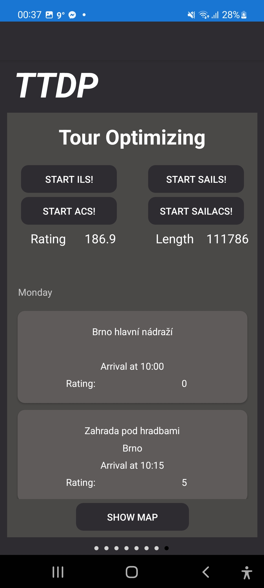
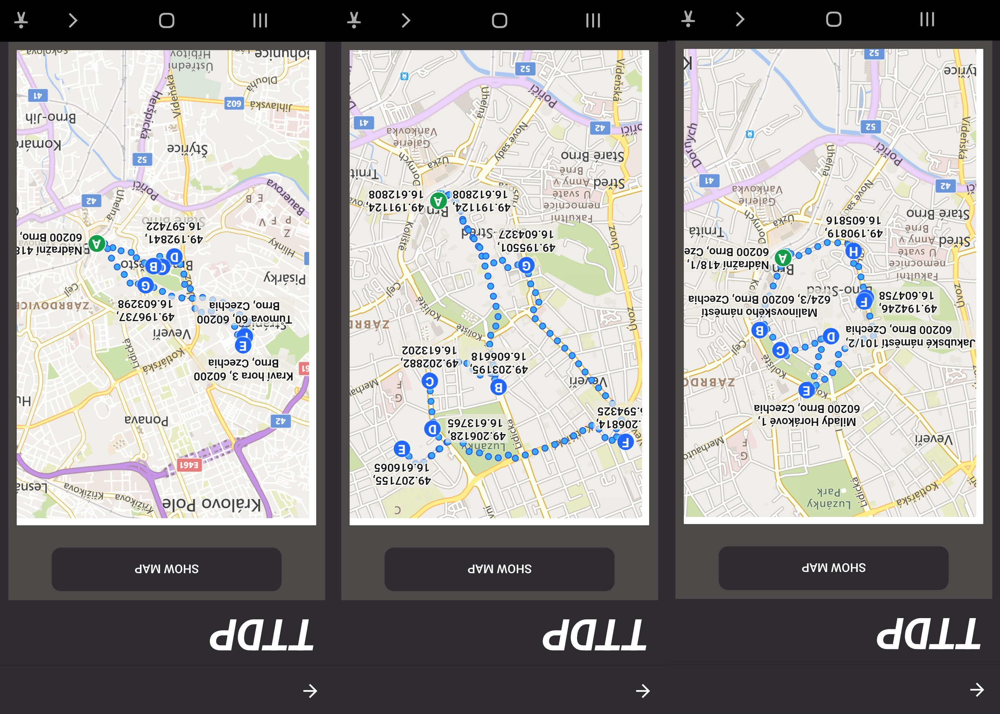

# Master's Thesis

## Tourist Trip Design Problem \[English]
**Abstract:** This master’s thesis deals with the Tourist Trip Design Problem. Designing a tourist route is non-trivial optimization problem which results in personalised tourist tour. The algorithms which solve the Tourist Trip Design Problem are implemented to work with real world data. These algorithms were used during development of mobile application.

**Keywords:** Tourist Trip Design Problem, team orienteering problem with time windows, iterated local search, ant colony system.

## About the work

Tourist Trip Design Problem (TTDP) is non-trivial optimization problem that deals with creating optimal route consisting of Points of View (POI) according to tourist's preferences, time budget, cost budget etc. The problem can be viewed in many ways, one of the most used models of viewing TTDP is so called Team Orienteering Problem with Time Windows (TOPTW).

In the work, several algorithms are implemented do solve TOPTW or TTDP respectively. Those are Iterated Local Search (ILS), SAILS (hybridization of ILS and simulating annealing) that are well established as good solvers of such problem. In addition, Ant Colony System (ACS) was implemented to solve the optimization problem. The algorithms were tested on real world data.

As a result, simple Android application was created. The application is written in C# using Xamarin Forms Framework. POIs with appropriatte data were aquired thanks to Foursquare API and the graph was created with Bing Maps API.

    <figure>
        
        <figcaption>Application</figcaption>
    </figure>

## Návrh optimální turistické trasy \[česky]
**Abstrakt:** Tato diplomová práce se zabývá návrhem optimální turistické trasy. Jedná se o netriviální optimalizační problém, jehož výsledkem je personalizovaná turistická trasa. V praktické části se implementují vybrané algoritmy řešící problém návrhu optimální turistické trasy na reálných datech. Implementace vybraných algoritmů jsou využity při tvorbě mobilní aplikace.

**Klíčová slova:** Návrh optimální turistické trasy, team orienteering problem with time windows,
iterované lokální prohledávání, ant colony system.

## O práci

Návrh optimální turistické trasy (TTDP) je netriviální optimalizační problém který se zabývá návrhem optimální trasy mezi místy zájmu (POI). Trasa je vytvořena na základě preferencí turisty, časového či cenového rozpočtu. Na úlohu se dá nahlížet několika způsoby, jedním z nejvyužívanějších modelů je tzv. Team Orienteering Problem with Time Windows (TOPTW).

V práci jsou implementovány některé algoritmy řešíci TOPTW rescpektive TTDP. Jsou to iterované lokální prohledávání (ILS), SAILS (hybridizace ILS a simulovaného žíhání). Oba algoritmy jsou uznávány jako dobré řešiče daného problému. Navíc byl navržen Ant Colony System (ACS) pro řešení úlohy. Algoritmy byly otestovány na datech z reálného světa.

Výsledkem práce je jednoduchá aplikace pro Android. Aplikace je napsána v jazyce C# za použití Xamarin Forms frameworku. Místa zájmu s podstatnými daty jsou získány pomocí Foursquare API a graf byl vytvořen pomocí Bing Maps API.

    <figure>
        
        <figcaption>Optimal route for Brno</figcaption>
    </figure>

